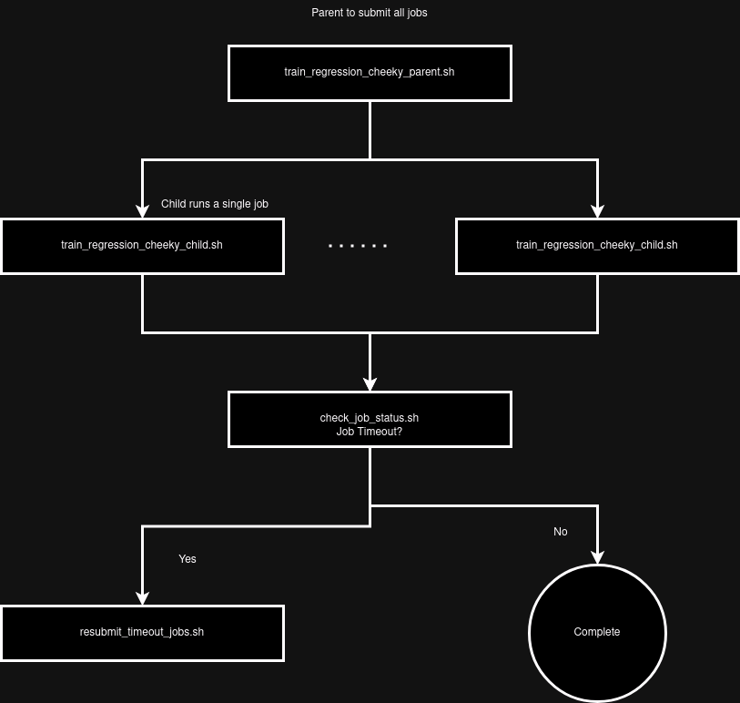

# Morphological features Predict Secretome Protein Abundance via Elastic Net

Here we show that morphological features can be used to predict the abundance of secretome proteins in a cell.
We use the [elastic net](https://towardsdatascience.com/ridge-lasso-and-elasticnet-regression-b1f9c00ea3a3) algorithm to predict the abundance of secretome proteins in a cell.
We leave one of each channel out to test the dependence of the model on the channel.
Specifically, the performance of the model when we remove a pyroptosis specific channel, Gasdermin D.
We also test the model performance when we remove a channel that is not specific to pyroptosis, such as the nuclear channel.
This is a control for information loss.

We test models that predict 187 cytokines from two different cell types (SH-SY5Y and PBMCs), 32 channel combinations, and both shuffled and unshuffled data.
This results in $187 \times 2 \times 32 \times 2 = 23936$ models.
To run this many we get 'cheeky' with the HPC.
We run parent - child processes to launch these models in parallel. 

